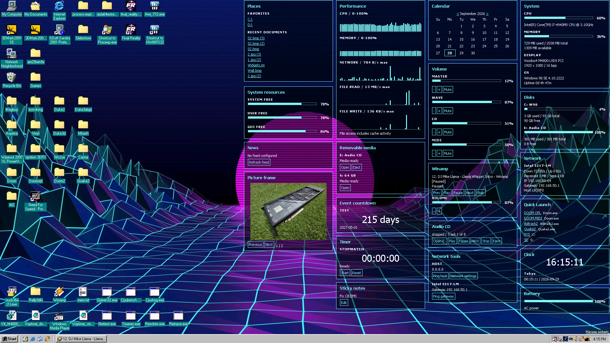

# Glass98

**Desktop widgets for Windows 98 Second Edition.**

Glass98 brings configurable, transparent HTML widgets to Active Desktop.
They sit on the desktop alongside your icons, behind normal application windows.



[More screenshots](images/)

## Widgets

| Widget | Features |
| --- | --- |
| System | CPU/RAM meters, CPU name and frequency, display adapter/mode, Windows version and uptime |
| Disks | Used/free space for selected drives; adapts to missing drives and empty media |
| Network | Selected interfaces, transfer rates/totals, IP address, gateway and hostname |
| Performance | Scrolling CPU, RAM, network and file read/write graphs |
| System resources | Free SYSTEM, USER and GDI resource pools |
| Memory details | Physical RAM, Windows paging capacity, collector virtual space and largest free virtual block |
| Battery | Charge level, AC/charging state and driver-reported remaining runtime |
| Clock | Digital clock, 12/24-hour modes and up to six fixed-offset world clocks |
| Calendar | Month navigation, today highlight and dated notes |
| Sticky notes | Scrollable text and clickable checklists |
| Timer | Countdown/stopwatch with pause, resume, reset and optional finish sound |
| Event countdown | Days remaining until, or elapsed since, a selected date |
| Volume | Master, Wave, CD and MIDI volume/mute controls where supported |
| Winamp | Track title, playback controls and volume for compatible running Winamp instances |
| Audio CD | Physical CD playback, previous/next track controls with wraparound, optional offline MusicBrainz titles and editable local titles |
| Quick Launch | Six labeled program, file, folder or shortcut slots |
| Places | Four favorite folders and eight recent documents |
| Removable media | Media status, open drive and CD eject |
| Picture frame | Up to six local images with manual navigation or slideshow |
| Desktop controls | Wallpaper switching, screensaver controls, Windows Appearance schemes and Glass98 themes |
| Calculator | Arithmetic, unit conversion and unsigned hex/decimal/binary conversion |
| Character map | Latin characters with click-to-copy and configurable font |
| Daily checklist | Up to 24 tasks, with check marks resetting at local midnight |
| Clipboard | Scrollable plain-text preview without a clipboard history |
| Network tools | On-demand host/gateway ping and access to Network settings |
| News | Rotating RSS/Atom headlines |

- Shared widget width, edge snapping and automatic placement in columns.
- Separate positions and enabled widgets for each screen resolution.
- Automatic fitting on first use of a resolution, with overflow marked Hidden.
- Per-widget colors, opacity and refresh rates, plus a global refresh override.
- An opaque rendering mode that removes alpha filters for slower systems.
- Built-in themes, saved custom themes and optional load-dependent meter colors.
- Automatic theme generation from your selected wallpaper.
- A widget manager for adding, removing and configuring widgets.
- Collection of optional data stops when no enabled widget needs it.
- Automatic pause while a fullscreen DOS session is active.

## How it works

A native background program, `W98DATA.EXE`, runs in user space and collects
system statistics through Windows APIs. It writes local JavaScript data files,
including `DATA.JS` and `EXTRA.JS`, in `C:\Glass98`. Collection stops for data
that no enabled widget needs.

The desktop is an HTML page displayed by Active Desktop using IE6's rendering
engine. Its JavaScript periodically reads those files and updates the widgets
at their configured refresh intervals; CSS controls their appearance. Native
helpers handle settings and actions such as volume changes and launching
programs.

When a fullscreen DOS session takes over the screen, Glass98 pauses telemetry
collection, widget refreshes and scheduled feed requests. It resumes when you
return to Windows, including after closing the DOS session or switching back
to the desktop. Windowed DOS sessions do not trigger the pause. A lightweight
250 ms state check remains active so the helpers and desktop can
resume automatically. An operation already in progress may finish as the
pause begins. Existing CD playback is left alone. This is enabled by default;
uncheck **Pause during fullscreen DOS** on the widget manager's **Desktop** tab
and apply to keep widgets running during fullscreen DOS sessions. No restart is needed.

## Requirements

- Windows 98 **Second Edition** (4.10.2222).
- Internet Explorer **6 SP1** ([archived installer](https://archive.org/details/IE6SP1)).
- High Color (16-bit) or True Color (24/32-bit) display mode.
- A writable `C:\Glass98` installation directory.

Download the IE 6 SP1 ZIP on a modern computer, extract it, transfer the complete
folder to the Windows 98 machine and run `IE6SETUP.EXE`. Restart before installing
Glass98.

No .NET or modern browser is required.
Winamp is optional and only needed for its widget. Internet access is only
needed for network-dependent features.

Glass98 renders HTML, CSS and JavaScript through IE6, so a reasonably fast CPU
is needed for a smooth experience, especially when dragging transparent widgets
or displaying several live graphs. On slower systems, disable transparency,
use fewer widgets and increase refresh intervals to reduce the load.

## Install or update

1. Extract the complete `Glass98.zip` package to a folder, including on removable media.
2. Close the widget manager, then run `INSTALL.BAT` from the extracted folder.
3. Setup copies the application to `C:\Glass98`, registers it and starts the helpers.
4. Open **Manage widgets** at the bottom-right of the desktop.

Run the new package's installer to update an existing installation. Usable
settings are preserved, with an INI backup made before preparation. Fresh
installations reuse the current Windows wallpaper, falling back to a bundled
640x480 solid teal bitmap if none is usable.

Run `C:\Glass98\REMOVE.BAT` to uninstall. It restores the saved desktop wallpaper,
removes the program files and retains `REMOVE.BAT` and the INI settings files.

See the [package manual](packaging/glass/README.TXT) for detailed controls.

## Layouts and themes

Drag widget titles to move them; hold Shift to bypass snapping. New widgets
use available column space without moving existing widgets. At a smaller
resolution, widgets that cannot fit are marked **Hidden** in the manager.
Returning to a saved resolution restores its widget selection and positions.
Colors, options and wallpaper are shared between resolutions.

The **Desktop** tab controls wallpaper, widget width, position locking and the
global refresh override. Under **Rendering**, enable **Disable transparency
(opaque widgets)** and click **Apply desktop** to remove alpha filters entirely.
Saved opacity values are retained; uncheck it to restore transparency.
The **Themes** tab selects presets, saves custom themes,
and generates colors and opacity from an image.

## Widget controls

The **Audio CD** widget shows the current track and track count. **Next** wraps
from the last track to track 1; **Prev** wraps from track 1 to the last track.

The package can include an optional **offline CD database** derived from
MusicBrainz's CC0 core data. Setup offers to install it and shows the required
disk space. Album and track names are matched locally using the CD's track
count and timings; no connection or account is required. Where multiple
releases match, the widget lets you cycle through them. Coverage is not
universal; mixed audio/data discs currently require manual titles.

The database stays on disk. Glass98 searches its sorted index and reads only
candidate album records, then caches the selected album's titles. Changing
tracks or refreshing the widget does not repeat the lookup. Memory use stays
small regardless of database size: about 51 KB for cached titles and a temporary
52 KB lookup buffer, plus bookkeeping and file buffering. See the
[CD database manual](packaging/glass/CDDATA.TXT).

Your own CD album and track names are stored locally in `CDTITLES.INI` and
override database titles. With an audio CD
opened, click **Edit titles**, edit its album/artist and numbered tracks in
Notepad, then save. The widget reads those titles when that disc is inserted.
No online database or additional library is required.

**Desktop controls** combines up to six wallpapers, screensaver start/enable/
disable, Windows Appearance schemes and saved Glass98 themes. Windows Appearance
lists the schemes installed on that computer, including custom schemes saved
through **Display Properties / Appearance**. Applying a scheme uses Windows'
own Display applet to update colors, fonts and sizes.

The **System** widget measures CPU frequency once per collector process and
saves successful readings. If calibration fails on a later startup, it uses a
saved reading for the same detected CPU, marked **cached**. If no matching
reading exists, it displays **CPU frequency unavailable**. These values are
not live turbo or throttling measurements.

The **Calculator** widget includes arithmetic, unit conversion and unsigned
32-bit hexadecimal/decimal/binary conversion. Choose a mode, enter a value,
and click **Calculate**.

The **Character map** starts with extended Latin characters. Click a character
to copy it; its font is configurable in widget options. The Windows code page
must support the character for it to copy correctly as plain text.

The **Daily checklist** accepts one task per line in widget options, up to
24 tasks. Check marks are saved and reset at local midnight. Editing the task
list clears its check marks.

The **Clipboard** widget reads plain text only (up to 2048 bytes). While enabled,
its preview is included in the local telemetry file. Disabling the widget clears
that preview on the next collection; there is no saved clipboard history.

## Build from source

Build on a modern Windows host using PowerShell and Open Watcom 2.0. Install the
compiler separately and set `WATCOM` to its installation root, or put it under
`tools/ow`.

```powershell
$env:WATCOM = 'C:\WATCOM'
powershell -ExecutionPolicy Bypass -File scripts/package-glass.ps1
powershell -ExecutionPolicy Bypass -File scripts/audit-imports.ps1 -Glass
```

The outputs are `dist/Glass98/` and `dist/Glass98.zip`.
See [build and test instructions](scripts/build.md). Run the commands from the
repository root.

## Limitations

- World clocks use fixed UTC offsets; daylight-saving changes are manual.
- News cannot connect directly to modern HTTPS feeds. Use an HTTP feed, or run
  a feed proxy on a modern computer on your local network that fetches the HTTPS
  feed and serves it over HTTP. Point the News widget at that local HTTP URL.
- File activity includes cache activity; it is not a physical disk-busy percentage.
- Hardware/driver-dependent readings are shown as unavailable when unsupported.
- The paging-capacity bar uses the total and available values reported by Windows.
  With automatic sizing, capacity can grow or shrink; 100% does not necessarily
  mean Windows is out of memory. Virtual memory and largest free block refer to the collector
  process.

When reporting a problem, include the release, hardware, IE version, display mode,
reproduction steps and whether it happens after a fresh install or update.

## Source layout

| Directory | Contents |
| --- | --- |
| `gadgets/glass` | Desktop and manager HTML, CSS and IE6-compatible JScript |
| `src/bridge` | Telemetry and device integration, including the Win16 resource helper |
| `src/glassctl` | Settings, themes, wallpaper and installation helpers |
| `src/gadgetctl` | Active Desktop and startup registration utilities |
| `scripts` | Build guide, packaging and regression checks |
| `packaging/glass` | Installation scripts and user manual |
| `licenses` | Third-party license texts |

## License

Glass98's own source and assets are released under the [MIT License](LICENSE).
The linked Open Watcom runtime retains its own license and notices; see
[NOTICE.TXT](NOTICE.TXT) and [WATCOM.TXT](licenses/WATCOM.TXT).
Windows, Internet Explorer and other external applications are not redistributed.
